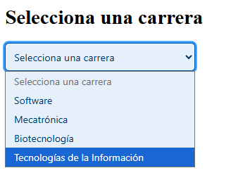
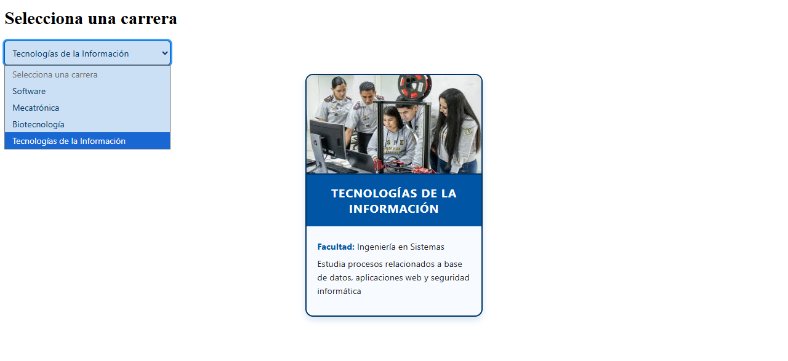

# ESPE Career Lit

**Autor:** Jordan Guevara

## Descripción

Este proyecto implementa dos componentes Web personalizados utilizando LitElement:

- `<career-selector>`: Un selector de carreras disponibles en la ESPE.
- `<career-card>`: Una tarjeta informativa que muestra detalles de una carrera seleccionada, con estilos temáticos basados en el último dígito de la cédula.

Ambos componentes están diseñados con una estructura clara y estilos profesionales, siguiendo buenas prácticas modernas.

---

## Instrucciones de uso

### 1. Clonar el repositorio

```bash
git clone https://github.com/JordanGuevara/examn-espe-careers.git
cd espe-career-lit
```
### 2. Instalar dependendencias
```bash
npm install
```
### 3. Iniciar el proyecto
```bash
npm start
```
#### Nota
Verificar que en el package.json este de la siguiente manera si es que no funciona la interaccion dentro del index ejecutando el siguiente comando: 
```bash
npx web-dev-server --open --node-resolve --app-index src/index.html
```
y si no, cambiar la siguiente linea del script por el siguiente:
```bash
"start": "web-dev-server --open --node-resolve --app-index src/index.html"
```

## Tablas de cada componente
### 1. Tabla Prop de `<career-selector>`
Emite un evento personalizado `<career-selected>` con los datos de la carrera seleccionada.
| Propiedad | Tipo  | Descripción                                                             |
| --------- | ----- | ----------------------------------------------------------------------- |
| `careers` | Array | Lista de carreras (cargadas automáticamente desde `data/careers.json`). |

### 2. Tabla Prop de `<career-card>`
Actualiza dinámicamente el contenido cuando recibe nuevos datos.
| Propiedad | Tipo   | Descripción                                      |
| --------- | ------ | ------------------------------------------------ |
| `career`  | Object | Objeto con los datos de la carrera seleccionada. |

### 3. Tabla Prop de `theme.js`
El componente `<career-card>` aplica estilos dinámicos desde themes.js usando el último dígito de la cédula 23xxxxxxx-1.

| Último dígito | Tema               |
| ------------- | ------------------ |
| 0–1           | Azul institucional |

## Evidencias del uso del componente
Vista del como se observa lo que es el componente de `<career-selector>`.



Vista del como se muestra los datos a través del uso del componente de `<career-card>` para su observación de información.


El uso de como interactúan dichos componentes entre sí


